# ANCHORED: Complete Database Design & Implementation Plan

## 🎯 Implementation Calendar & Phases

### **Phase 1: MVP 1.0 "SURVIVAL MODE"** 
*July 3 - August 13, 2025 (6 weeks)*
- **DEADLINE:** Ready for live testing by August 13, 2025
- **Goal:** Bulletproof basics, live community feeling
- **Features:** QR scan → mood selection → live counter → basic word submission
- **Database Priority:** Sessions, Participants, Basic Word Cloud

### **Phase 2: MVP 2.0 "THE MAGIC"** 
*August - October 2025 (10 weeks)*
- **Goal:** AI assistance and intelligent interactions  
- **Features:** Smart group formation, AI verse suggestions, real-time voting
- **Database Priority:** Groups, AI Interactions, Voting System

### **Phase 3: MVP 3.0 "THE REVOLUTION"**
*November - December 2025 (8 weeks)*
- **Goal:** Lasting connections, community platform
- **Database Priority:** User Profiles, Connections, Analytics

### **QCF 2026 CONFERENCE**
*January 2026*
- **THE BIG EVENT:** Live deployment with full community experience

### **Phase 4: POST-QCF PLATFORM**
*Post-January 2026*
- **Goal:** White-label platform, enterprise features
- **Database Priority:** Multi-tenancy, Organizations, Advanced Analytics

---

## 📊 Database Entity Relationship Diagram

```mermaid
%%{init: {'theme':'dark', 'themeVariables': { 'darkMode': true, 'background': '#0f1419', 'primaryColor': '#4f46e5', 'primaryTextColor': '#e2e8f0', 'primaryBorderColor': '#6366f1', 'lineColor': '#64748b', 'sectionBkColor': '#1e293b', 'altSectionBkColor': '#334155', 'gridColor': '#475569', 'secondaryColor': '#06b6d4', 'tertiaryColor': '#8b5cf6'}}}%%
erDiagram
    %% 🔥 PHASE 1: MVP 1.0 TABLES (CORE FOUNDATION)
    sessions {
        uuid id PK "🔑 Primary Key"
        text name "📋 Session Name"
        text event_code "🎯 QR Code ID"
        boolean active "✅ Is Live"
        integer participant_count "👥 Live Count"
        timestamp created_at "📅 Created"
        timestamp updated_at "🔄 Updated"
        text status "📊 Status"
        json metadata "📦 Extra Data"
    }
    
    participants {
        uuid id PK "🔑 Primary Key"
        uuid session_id FK "🔗 Session Link"
        text mood_emoji "😊 User Mood"
        text mood_label "🏷️ Mood Text"
        text user_agent "📱 Device Info"
        text ip_address_hash "🔒 Privacy Hash"
        timestamp joined_at "⏰ Join Time"
        timestamp last_active "💫 Last Seen"
        boolean is_active "🟢 Online"
        json metadata "📦 Extra Data"
    }
    
    words {
        uuid id PK "🔑 Primary Key"
        uuid session_id FK "🔗 Session Link"
        uuid participant_id FK "👤 Author"
        text content "💬 Word Content"
        text mood_context "🎭 Mood Context"
        integer display_order "🎯 Order"
        timestamp created_at "📅 Created"
        boolean approved "✅ Approved"
        text status "📊 Status"
    }
    
    %% ✨ PHASE 2: MVP 2.0 TABLES (AI MAGIC)
    groups {
        uuid id PK "🔑 Primary Key"
        uuid session_id FK "🔗 Session Link"
        text name "👥 Group Name"
        text formation_method "🧠 AI Method"
        integer max_size "📏 Max Size"
        timestamp created_at "📅 Created"
        boolean active "✅ Active"
        json metadata "📦 Extra Data"
    }
    
    group_members {
        uuid id PK "🔑 Primary Key"
        uuid group_id FK "👥 Group Link"
        uuid participant_id FK "👤 Member"
        text role "🎭 Role"
        timestamp joined_at "⏰ Joined"
        boolean active "🟢 Active"
    }
    
    verses {
        uuid id PK "🔑 Primary Key"
        uuid session_id FK "🔗 Session Link"
        uuid group_id FK "👥 Group"
        text content "🎵 Verse Text"
        text verse_number "🔢 Verse #"
        text theme "🎨 Theme"
        timestamp created_at "📅 Created"
        text status "📊 Status"
        json ai_metadata "🤖 AI Data"
    }
    
    verse_contributions {
        uuid id PK "🔑 Primary Key"
        uuid verse_id FK "🎵 Verse Link"
        uuid participant_id FK "👤 Author"
        text line_content "📝 Line Text"
        integer line_number "🔢 Line #"
        timestamp created_at "📅 Created"
        boolean approved "✅ Approved"
        text source_type "🎯 Source"
    }
    
    votes {
        uuid id PK "🔑 Primary Key"
        uuid participant_id FK "👤 Voter"
        uuid target_id "🎯 Target"
        text target_type "📋 Type"
        text vote_type "👍 Vote Kind"
        integer value "🔢 Value"
        timestamp created_at "📅 Created"
        json metadata "📦 Extra Data"
    }
    
    ai_interactions {
        uuid id PK "🔑 Primary Key"
        uuid session_id FK "🔗 Session Link"
        uuid participant_id FK "👤 User"
        text interaction_type "🤖 AI Type"
        text prompt "💭 Input"
        text response "🎯 Output"
        text model_used "🧠 AI Model"
        timestamp created_at "📅 Created"
        json metadata "📦 Extra Data"
    }
    
    %% 🚀 PHASE 3: MVP 3.0 TABLES (COMMUNITY)
    user_profiles {
        uuid id PK "🔑 Primary Key"
        text email "📧 Email"
        text name "👤 Name"
        text anchor_story "⚓ Story"
        text commitment "🤝 Promise"
        text location "📍 Location"
        timestamp created_at "📅 Created"
        timestamp updated_at "🔄 Updated"
        boolean active "✅ Active"
        json preferences "⚙️ Settings"
    }
    
    connections {
        uuid id PK "🔑 Primary Key"
        uuid user1_id FK "👤 User 1"
        uuid user2_id FK "👤 User 2"
        text connection_type "🔗 Type"
        text status "📊 Status"
        timestamp created_at "📅 Created"
        timestamp updated_at "🔄 Updated"
        json metadata "📦 Extra Data"
    }
    
    anchor_circles {
        uuid id PK "🔑 Primary Key"
        text name "⚓ Circle Name"
        text description "📝 Description"
        uuid creator_id FK "👤 Creator"
        timestamp created_at "📅 Created"
        boolean active "✅ Active"
        json settings "⚙️ Config"
    }
    
    circle_members {
        uuid id PK "🔑 Primary Key"
        uuid circle_id FK "⚓ Circle"
        uuid user_id FK "👤 Member"
        text role "🎭 Role"
        timestamp joined_at "⏰ Joined"
        boolean active "✅ Active"
    }
    
    prayer_requests {
        uuid id PK "🔑 Primary Key"
        uuid user_id FK "👤 Requester"
        uuid circle_id FK "⚓ Circle"
        text content "🙏 Request"
        text category "📋 Category"
        text status "📊 Status"
        timestamp created_at "📅 Created"
        timestamp updated_at "🔄 Updated"
        boolean anonymous "🔒 Private"
    }
    
    %% 🌐 PHASE 4: PLATFORM TABLES (ENTERPRISE)
    organizations {
        uuid id PK "🔑 Primary Key"
        text name "🏢 Org Name"
        text domain "🌐 Domain"
        text subscription_tier "💳 Plan"
        json settings "⚙️ Config"
        timestamp created_at "📅 Created"
        boolean active "✅ Active"
    }
    
    organization_users {
        uuid id PK "🔑 Primary Key"
        uuid organization_id FK "🏢 Org Link"
        uuid user_id FK "👤 User"
        text role "🎭 Role"
        timestamp created_at "📅 Created"
        boolean active "✅ Active"
    }
    
    analytics_events {
        uuid id PK "🔑 Primary Key"
        uuid session_id FK "🔗 Session"
        uuid participant_id FK "👤 User"
        uuid organization_id FK "🏢 Org"
        text event_type "📊 Type"
        text event_name "🏷️ Name"
        json properties "📦 Data"
        timestamp created_at "📅 Created"
    }

    %% 🔗 RELATIONSHIPS (COLOR-CODED BY PHASE)
    sessions ||--o{ participants : "👥 has"
    sessions ||--o{ words : "💬 contains"
    sessions ||--o{ groups : "🎯 organizes"
    sessions ||--o{ verses : "🎵 creates"
    
    participants ||--o{ words : "✍️ submits"
    participants ||--o{ votes : "👍 casts"
    participants ||--o{ ai_interactions : "🤖 triggers"
    participants ||--o{ verse_contributions : "📝 contributes"
    
    groups ||--o{ group_members : "👥 contains"
    groups ||--o{ verses : "🎵 creates"
    
    verses ||--o{ verse_contributions : "📝 receives"
    
    user_profiles ||--o{ connections : "🔗 connects"
    user_profiles ||--o{ anchor_circles : "⚓ creates"
    user_profiles ||--o{ circle_members : "👥 joins"
    user_profiles ||--o{ prayer_requests : "🙏 submits"
    
    organizations ||--o{ organization_users : "🏢 employs"
    organizations ||--o{ sessions : "🎯 hosts"
```



---

## 🗄️ Detailed Table Documentation

### **PHASE 1: MVP 1.0 TABLES**

#### **sessions**
Primary table for each ANCHORED experience session.
```sql
CREATE TABLE sessions (
    id uuid DEFAULT gen_random_uuid() PRIMARY KEY,
    name text NOT NULL DEFAULT 'ANCHORED Experience',
    event_code text UNIQUE, -- QR code identifier
    active boolean DEFAULT true,
    participant_count integer DEFAULT 0,
    created_at timestamp with time zone DEFAULT timezone('utc'::text, now()) NOT NULL,
    updated_at timestamp with time zone DEFAULT timezone('utc'::text, now()) NOT NULL,
    status text DEFAULT 'active' CHECK (status IN ('active', 'paused', 'completed')),
    metadata jsonb DEFAULT '{}'::jsonb
);
```

#### **participants**
Anonymous participants in each session (no persistent user accounts in MVP 1.0).
```sql
CREATE TABLE participants (
    id uuid DEFAULT gen_random_uuid() PRIMARY KEY,
    session_id uuid REFERENCES sessions(id) ON DELETE CASCADE,
    mood_emoji text NOT NULL,
    mood_label text NOT NULL,
    user_agent text,
    ip_address_hash text, -- Hashed for privacy
    joined_at timestamp with time zone DEFAULT timezone('utc'::text, now()) NOT NULL,
    last_active timestamp with time zone DEFAULT timezone('utc'::text, now()) NOT NULL,
    is_active boolean DEFAULT true,
    metadata jsonb DEFAULT '{}'::jsonb
);
```

#### **words**
Community word cloud submissions.
```sql
CREATE TABLE words (
    id uuid DEFAULT gen_random_uuid() PRIMARY KEY,
    session_id uuid REFERENCES sessions(id) ON DELETE CASCADE,
    participant_id uuid REFERENCES participants(id) ON DELETE CASCADE,
    content text NOT NULL,
    mood_context text, -- What mood led to this word
    display_order integer,
    created_at timestamp with time zone DEFAULT timezone('utc'::text, now()) NOT NULL,
    approved boolean DEFAULT true,
    status text DEFAULT 'active' CHECK (status IN ('active', 'hidden', 'flagged'))
);
```

### **PHASE 2: MVP 2.0 TABLES**

#### **groups**
Smart group formation for verse creation.
```sql
CREATE TABLE groups (
    id uuid DEFAULT gen_random_uuid() PRIMARY KEY,
    session_id uuid REFERENCES sessions(id) ON DELETE CASCADE,
    name text,
    formation_method text DEFAULT 'ai_similarity', -- 'ai_similarity', 'manual', 'random'
    max_size integer DEFAULT 4,
    created_at timestamp with time zone DEFAULT timezone('utc'::text, now()) NOT NULL,
    active boolean DEFAULT true,
    metadata jsonb DEFAULT '{}'::jsonb
);
```

#### **verses**
Collaborative verse creation.
```sql
CREATE TABLE verses (
    id uuid DEFAULT gen_random_uuid() PRIMARY KEY,
    session_id uuid REFERENCES sessions(id) ON DELETE CASCADE,
    group_id uuid REFERENCES groups(id) ON DELETE CASCADE,
    content text,
    verse_number text, -- "Verse 3", "Bridge", etc.
    theme text,
    created_at timestamp with time zone DEFAULT timezone('utc'::text, now()) NOT NULL,
    status text DEFAULT 'in_progress' CHECK (status IN ('in_progress', 'completed', 'approved')),
    ai_metadata jsonb DEFAULT '{}'::jsonb
);
```

#### **ai_interactions**
Track all AI assistance for optimization.
```sql
CREATE TABLE ai_interactions (
    id uuid DEFAULT gen_random_uuid() PRIMARY KEY,
    session_id uuid REFERENCES sessions(id) ON DELETE CASCADE,
    participant_id uuid REFERENCES participants(id) ON DELETE CASCADE,
    interaction_type text NOT NULL, -- 'rhyme_suggestion', 'meter_check', 'theme_completion'
    prompt text NOT NULL,
    response text NOT NULL,
    model_used text DEFAULT 'gpt-4',
    created_at timestamp with time zone DEFAULT timezone('utc'::text, now()) NOT NULL,
    metadata jsonb DEFAULT '{}'::jsonb
);
```

### **PHASE 3: MVP 3.0 TABLES**

#### **user_profiles**
Persistent user accounts for ongoing community.
```sql
CREATE TABLE user_profiles (
    id uuid DEFAULT gen_random_uuid() PRIMARY KEY,
    email text UNIQUE,
    name text NOT NULL,
    anchor_story text,
    commitment text,
    location text,
    created_at timestamp with time zone DEFAULT timezone('utc'::text, now()) NOT NULL,
    updated_at timestamp with time zone DEFAULT timezone('utc'::text, now()) NOT NULL,
    active boolean DEFAULT true,
    preferences jsonb DEFAULT '{}'::jsonb
);
```

---

## 🚀 Implementation Priority Order

### **MVP 1.0 Sprint (July 3 - August 13, 2025)**

#### **Week 1 (July 3-10): Core Foundation**
1. `sessions` table + real-time counter
2. `participants` table + mood tracking
3. Basic Supabase client setup

#### **Week 2 (July 10-17): Community Features**  
1. `words` table + live word cloud
2. Real-time subscriptions
3. Content moderation

#### **Week 3-4 (July 17-31): Polish & Testing**
1. Load testing with 60+ participants
2. Offline-first PWA features
3. QR code integration
4. Performance optimization

#### **Week 5-6 (July 31 - Aug 13): Final Sprint**
1. End-to-end testing
2. Content filtering
3. Admin dashboard
4. Deployment & monitoring

### **MVP 2.0 Development (August - October 2025)**

#### **August: Intelligence Layer**
1. `groups` + `group_members` tables
2. `ai_interactions` table
3. OpenAI integration

#### **September: Collaboration Engine**
1. `verses` + `verse_contributions` tables
2. `votes` table + real-time voting
3. AI-assisted verse creation

#### **October: Testing & Refinement**
1. Advanced AI features
2. Group formation algorithms
3. Performance optimization

### **MVP 3.0 Development (November - December 2025)**

#### **November: Community Platform**
1. `user_profiles` table
2. `connections` + `anchor_circles` tables  
3. Authentication system

#### **December: Pre-Conference Polish**
1. Community onboarding flows
2. Advanced analytics
3. Conference-ready deployment

### **Post-Conference (February 2026+)**
1. `organizations` table
2. `analytics_events` table
3. Multi-tenancy preparation

---

## 🔒 Security & Privacy Considerations

### **Data Privacy**
- IP addresses are hashed, never stored plaintext
- Anonymous participation in MVP 1.0
- Optional email collection in MVP 3.0
- GDPR-compliant data retention policies

### **Content Moderation**
- Profanity filtering on word submissions
- Admin approval workflow for verse content
- Flagging system for inappropriate content

### **Authentication Evolution**
- **Phase 1:** Anonymous sessions only
- **Phase 3:** Optional email signup  
- **Phase 4:** Full organization SSO

---

## 📈 Scaling Considerations

### **Performance Optimization**
- Database indexes on frequently queried fields
- Real-time connection pooling
- Caching for read-heavy operations

### **Real-time Architecture**
- Supabase real-time subscriptions for live features
- WebSocket fallbacks for older browsers
- Rate limiting to prevent spam

### **Multi-tenancy Preparation**
- Organization-scoped data access
- Tenant-specific configurations
- Resource isolation and billing

---

## 🧪 Testing Strategy

### **MVP 1.0 Validation (Ready by August 13, 2025)**
- [ ] 60+ simultaneous participants
- [ ] Live counter accuracy under load
- [ ] Word submissions without lag
- [ ] Graceful offline degradation
- [ ] Cross-device compatibility (iOS/Android/Desktop)
- [ ] Network failure recovery

### **MVP 2.0 Validation (October 2025)**  
- [ ] AI response times < 3 seconds
- [ ] Group formation algorithms
- [ ] Real-time voting synchronization

### **MVP 3.0 Validation (December 2025)**
- [ ] User account creation flow
- [ ] Community platform onboarding
- [ ] Data export/import functionality

### **QCF 2026 Conference Readiness (January 2026)**
- [ ] 500+ participant stress test
- [ ] Backup deployment systems
- [ ] Real-time monitoring and alerts
- [ ] Live support dashboard

---

*This database design supports the complete ANCHORED vision from MVP 1.0 through enterprise platform, with clear implementation phases and scalability built-in.*