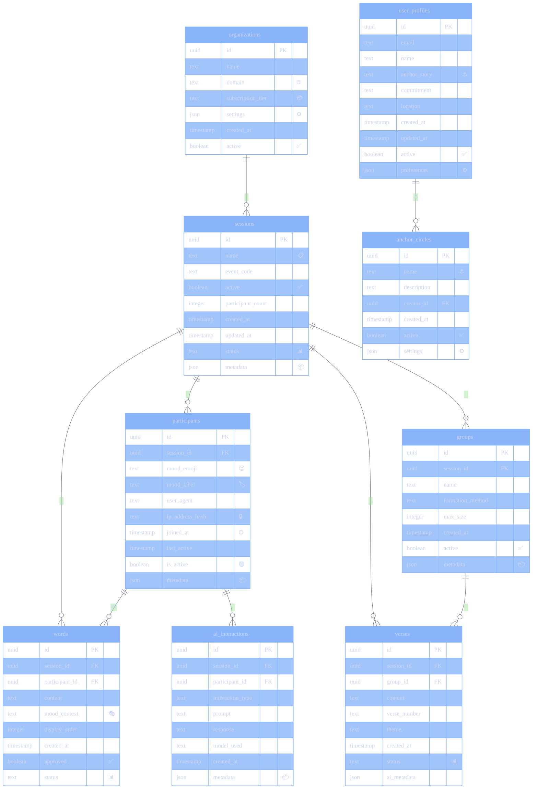

# ANCHORED Database Entity Relationship Diagram

## 🎯 Quick Reference
- **🔥 Red Tables:** MVP 1.0 (Core Foundation) - Build First!
- **✨ Blue Tables:** MVP 2.0 (AI Magic) - Build Second  
- **🚀 Green Tables:** MVP 3.0 (Community) - Build Third
- **🌐 Purple Tables:** Platform (Enterprise) - Build Last

---

## 📋 Phase Priority

### 🔥 Build First (MVP 1.0)
1. **sessions** - Core session management
2. **participants** - Anonymous user tracking  
3. **words** - Community word cloud

### ✨ Build Second (MVP 2.0)
4. **groups** - Smart group formation
5. **verses** - Collaborative song creation
6. **ai_interactions** - AI assistance tracking

### 🚀 Build Third (MVP 3.0)  
7. **user_profiles** - Persistent accounts
8. **anchor_circles** - Community groups

### 🌐 Build Last (Platform)
9. **organizations** - Multi-tenant platform

---

**View Full Documentation:** [Database Design](database-design.md)