# ANCHORED Database Entity Relationship Diagram

## 🎯 Quick Reference
- **🔥 Red Tables:** MVP 1.0 (Core Foundation) - Build First!
- **✨ Blue Tables:** MVP 2.0 (AI Magic) - Build Second  
- **🚀 Green Tables:** MVP 3.0 (Community) - Build Third
- **🌐 Purple Tables:** Platform (Enterprise) - Build Last

---

```mermaid
%%{init: {'theme':'base', 'themeVariables': { 'background': '#0a0e27', 'primaryColor': '#4f8ef7', 'primaryTextColor': '#ffffff', 'primaryBorderColor': '#4f8ef7', 'lineColor': '#64b5f6', 'sectionBkColor': '#1e3a8a', 'altSectionBkColor': '#3b82f6', 'gridColor': '#ffffff', 'secondaryColor': '#06b6d4', 'tertiaryColor': '#10b981', 'quaternaryColor': '#8b5cf6', 'fontFamily': 'Arial, sans-serif', 'fontSize': '13px'}}}%%
erDiagram
    %% 🔥 PHASE 1: MVP 1.0 - CORE FOUNDATION
    sessions {
        uuid id PK "🔑 PRIMARY_KEY"
        text name "📋 SESSION_NAME"
        text event_code "🎯 QR_CODE_ID"
        boolean active "✅ IS_LIVE"
        integer participant_count "👥 LIVE_COUNT"
        timestamp created_at "📅 CREATED"
        timestamp updated_at "🔄 UPDATED"
        text status "📊 STATUS"
        json metadata "📦 EXTRA_DATA"
    }
    
    participants {
        uuid id PK "🔑 PRIMARY_KEY"
        uuid session_id FK "🔗 SESSION_LINK"
        text mood_emoji "😊 USER_MOOD"
        text mood_label "🏷️ MOOD_TEXT"
        text user_agent "📱 DEVICE_INFO"
        text ip_address_hash "🔒 PRIVACY_HASH"
        timestamp joined_at "⏰ JOIN_TIME"
        timestamp last_active "💫 LAST_SEEN"
        boolean is_active "🟢 ONLINE"
        json metadata "📦 EXTRA_DATA"
    }
    
    words {
        uuid id PK "🔑 PRIMARY_KEY"
        uuid session_id FK "🔗 SESSION_LINK"
        uuid participant_id FK "👤 AUTHOR"
        text content "💬 WORD_CONTENT"
        text mood_context "🎭 MOOD_CONTEXT"
        integer display_order "🎯 ORDER"
        timestamp created_at "📅 CREATED"
        boolean approved "✅ APPROVED"
        text status "📊 STATUS"
    }
    
    %% ✨ PHASE 2: MVP 2.0 - AI MAGIC
    groups {
        uuid id PK "🔑 PRIMARY_KEY"
        uuid session_id FK "🔗 SESSION_LINK"
        text name "👥 GROUP_NAME"
        text formation_method "🧠 AI_METHOD"
        integer max_size "📏 MAX_SIZE"
        timestamp created_at "📅 CREATED"
        boolean active "✅ ACTIVE"
        json metadata "📦 EXTRA_DATA"
    }
    
    verses {
        uuid id PK "🔑 PRIMARY_KEY"
        uuid session_id FK "🔗 SESSION_LINK"
        uuid group_id FK "👥 GROUP_LINK"
        text content "🎵 VERSE_TEXT"
        text verse_number "🔢 VERSE_NUMBER"
        text theme "🎨 THEME"
        timestamp created_at "📅 CREATED"
        text status "📊 STATUS"
        json ai_metadata "🤖 AI_DATA"
    }
    
    ai_interactions {
        uuid id PK "🔑 PRIMARY_KEY"
        uuid session_id FK "🔗 SESSION_LINK"
        uuid participant_id FK "👤 USER_LINK"
        text interaction_type "🤖 AI_TYPE"
        text prompt "💭 INPUT"
        text response "🎯 OUTPUT"
        text model_used "🧠 AI_MODEL"
        timestamp created_at "📅 CREATED"
        json metadata "📦 EXTRA_DATA"
    }
    
    %% 🚀 PHASE 3: MVP 3.0 - COMMUNITY
    user_profiles {
        uuid id PK "🔑 PRIMARY_KEY"
        text email "📧 EMAIL"
        text name "👤 NAME"
        text anchor_story "⚓ STORY"
        text commitment "🤝 PROMISE"
        text location "📍 LOCATION"
        timestamp created_at "📅 CREATED"
        timestamp updated_at "🔄 UPDATED"
        boolean active "✅ ACTIVE"
        json preferences "⚙️ SETTINGS"
    }
    
    anchor_circles {
        uuid id PK "🔑 PRIMARY_KEY"
        text name "⚓ CIRCLE_NAME"
        text description "📝 DESCRIPTION"
        uuid creator_id FK "👤 CREATOR_LINK"
        timestamp created_at "📅 CREATED"
        boolean active "✅ ACTIVE"
        json settings "⚙️ CONFIG"
    }
    
    %% 🌐 PHASE 4: PLATFORM - ENTERPRISE
    organizations {
        uuid id PK "🔑 PRIMARY_KEY"
        text name "🏢 ORG_NAME"
        text domain "🌐 DOMAIN"
        text subscription_tier "💳 PLAN"
        json settings "⚙️ CONFIG"
        timestamp created_at "📅 CREATED"
        boolean active "✅ ACTIVE"
    }

    %% 🔗 CORE RELATIONSHIPS (MVP 1.0)
    sessions ||--o{ participants : "has participants"
    sessions ||--o{ words : "contains words"
    participants ||--o{ words : "submits words"
    
    %% 🔗 AI RELATIONSHIPS (MVP 2.0)  
    sessions ||--o{ groups : "organizes groups"
    sessions ||--o{ verses : "creates verses"
    sessions ||--o{ ai_interactions : "has AI calls"
    participants ||--o{ ai_interactions : "triggers AI"
    groups ||--o{ verses : "creates verses"
    
    %% 🔗 COMMUNITY RELATIONSHIPS (MVP 3.0)
    user_profiles ||--o{ anchor_circles : "creates circles"
    
    %% 🔗 PLATFORM RELATIONSHIPS (Enterprise)
    organizations ||--o{ sessions : "hosts sessions"
```

## 📋 Phase Priority

### 🔥 Build First (MVP 1.0)
1. **sessions** - Core session management
2. **participants** - Anonymous user tracking  
3. **words** - Community word cloud

### ✨ Build Second (MVP 2.0)
4. **groups** - Smart group formation
5. **verses** - Collaborative song creation
6. **ai_interactions** - AI assistance tracking

### 🚀 Build Third (MVP 3.0)  
7. **user_profiles** - Persistent accounts
8. **anchor_circles** - Community groups

### 🌐 Build Last (Platform)
9. **organizations** - Multi-tenant platform

---

**View Full Documentation:** [Database Design](database-design.md)