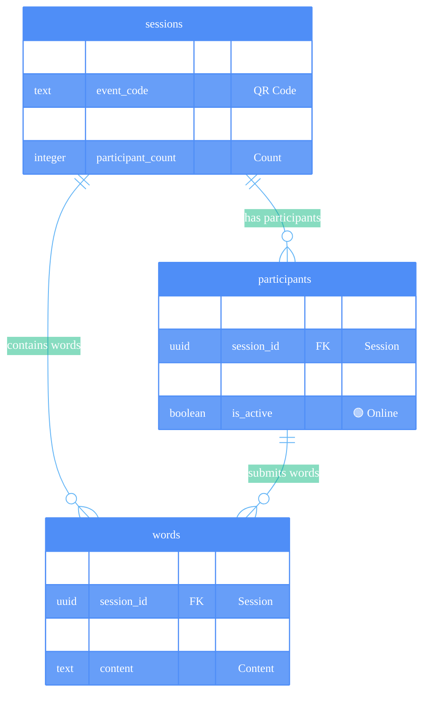

# ANCHORED MVP 1.0 - Absolute Bare Minimum
## 🔥 Just What We Need to Get It Working

**Philosophy:** Start with the smallest possible schema that enables the core experience, then add columns as needed.

---



---

## 🎯 Absolute Bare Minimum Tables

### **sessions** - Just session tracking
```sql
CREATE TABLE sessions (
    id uuid DEFAULT gen_random_uuid() PRIMARY KEY,
    event_code text UNIQUE NOT NULL, -- QR code lookup
    active boolean DEFAULT true, -- Is session live?
    participant_count integer DEFAULT 0 -- Live counter cache
);
```

### **participants** - Just mood + active status  
```sql
CREATE TABLE participants (
    id uuid DEFAULT gen_random_uuid() PRIMARY KEY,
    session_id uuid REFERENCES sessions(id) ON DELETE CASCADE,
    mood_emoji text NOT NULL, -- 😌 💪 🤗 😔 🙏 ❤️ 🤔 ✨
    is_active boolean DEFAULT true -- For live counter
);
```

### **words** - Just content + relationships
```sql
CREATE TABLE words (
    id uuid DEFAULT gen_random_uuid() PRIMARY KEY,
    session_id uuid REFERENCES sessions(id) ON DELETE CASCADE,
    participant_id uuid REFERENCES participants(id) ON DELETE CASCADE,
    content text NOT NULL -- The word they submitted
);
```

---

## ✅ What This Enables

### **Core User Experience**
1. **QR Scan** → Look up session by `event_code` ✅
2. **Mood Selection** → Create participant with `mood_emoji` ✅  
3. **Live Counter** → Show `participant_count` from sessions table ✅
4. **Word Submission** → Insert into `words` table ✅
5. **Live Word Cloud** → Query `words` by `session_id` ✅

### **Real-time Features**
- **Live Counter:** Update `sessions.participant_count` when participants join/leave
- **Live Words:** Subscribe to `words` table changes for real-time word cloud
- **Mood Distribution:** Count `mood_emoji` values from `participants` table

---

## 🚀 Easy Columns to Add Later

### **When we need timestamps:**
```sql
ALTER TABLE sessions ADD COLUMN created_at timestamp DEFAULT now();
ALTER TABLE participants ADD COLUMN joined_at timestamp DEFAULT now();
ALTER TABLE words ADD COLUMN created_at timestamp DEFAULT now();
```

### **When we need session names:**
```sql
ALTER TABLE sessions ADD COLUMN name text DEFAULT 'ANCHORED Experience';
```

### **When we need content moderation:**
```sql
ALTER TABLE words ADD COLUMN approved boolean DEFAULT true;
```

### **When we need analytics:**
```sql
ALTER TABLE participants ADD COLUMN user_agent text;
ALTER TABLE participants ADD COLUMN joined_at timestamp DEFAULT now();
```

### **When we need metadata:**
```sql
ALTER TABLE sessions ADD COLUMN metadata jsonb DEFAULT '{}';
ALTER TABLE participants ADD COLUMN metadata jsonb DEFAULT '{}';
```

---

## 🎯 What We Removed (Can Add Back Easily)

### **From sessions:**
- ❌ `name` (can default to 'ANCHORED Experience')
- ❌ `created_at`/`updated_at` (add when we need analytics)
- ❌ `status` (just use `active` boolean for now)
- ❌ `metadata` (add when we need extensibility)

### **From participants:**
- ❌ `mood_label` (can derive from emoji mapping)
- ❌ `user_agent` (add for analytics later)
- ❌ `ip_address_hash` (add for moderation later)
- ❌ `joined_at`/`last_active` (add for analytics later)
- ❌ `metadata` (add when needed)

### **From words:**
- ❌ `mood_context` (can correlate via participant relationship)
- ❌ `display_order` (can handle client-side initially)
- ❌ `created_at` (add when we need chronological ordering)
- ❌ `approved` (start with all words auto-approved)
- ❌ `status` (add when we need moderation states)

---

## 🚀 Implementation Strategy

### **Step 1: Create These 3 Tables (15 minutes)**
- Create in Supabase with exact SQL above
- Test basic INSERT/SELECT operations
- Set up foreign key relationships

### **Step 2: Build Core App Features (Day 1)**
- Session lookup by `event_code`
- Participant creation with mood
- Word submission
- Live counter display

### **Step 3: Add Real-time (Day 2)**
- Supabase subscriptions on `participants` and `words`
- Live participant counter updates
- Live word cloud updates

### **Step 4: Add Columns as Needed (Ongoing)**
- Add timestamps when we need chronological features
- Add moderation when we need content filtering
- Add analytics when we need usage tracking

---

## 🎯 Success Metrics for Bare Minimum

- [ ] **QR scan loads session** instantly
- [ ] **Mood selection creates participant** 
- [ ] **Live counter shows accurate count**
- [ ] **Word submission appears in real-time**
- [ ] **60+ people can participate** simultaneously
- [ ] **Works with poor WiFi** (offline-first)

**This is our bulletproof foundation! Add complexity only when we need it. 🎯**
