```mermaid
%%{init: {'theme':'base', 'themeVariables': { 'background': '#0a0e27', 'primaryColor': '#4f8ef7', 'primaryTextColor': '#ffffff', 'primaryBorderColor': '#4f8ef7', 'lineColor': '#64b5f6', 'sectionBkColor': '#2563eb', 'altSectionBkColor': '#7c3aed', 'gridColor': '#ffffff', 'secondaryColor': '#06b6d4', 'tertiaryColor': '#10b981', 'quaternaryColor': '#8b5cf6', 'fontFamily': 'Arial, sans-serif', 'fontSize': '13px'}}}%%
erDiagram
    %% 🔥 MVP 1.0 CORE TABLES - BULLETPROOF BASICS
    sessions {
        uuid id PK "🔑 PK"
        text name "📋 Name"
        text event_code "🎯 QR Code"
        boolean active "✅ Live"
        integer participant_count "👥 Count"
        timestamp created_at "📅 Created"
        timestamp updated_at "🔄 Updated"
        text status "📊 Status"
        json metadata "📦 Meta"
    }
    
    participants {
        uuid id PK "🔑 PK"
        uuid session_id FK "🔗 Session"
        text mood_emoji "😊 Mood"
        text mood_label "🏷️ Label"
        text user_agent "📱 Device"
        text ip_address_hash "🔒 IP Hash"
        timestamp joined_at "⏰ Joined"
        timestamp last_active "💫 Active"
        boolean is_active "🟢 Online"
        json metadata "📦 Meta"
    }
    
    words {
        uuid id PK "🔑 PK"
        uuid session_id FK "🔗 Session"
        uuid participant_id FK "👤 Author"
        text content "💬 Content"
        text mood_context "🎭 Context"
        integer display_order "🎯 Order"
        timestamp created_at "📅 Created"
        boolean approved "✅ OK"
        text status "📊 Status"
    }

    %% 🔗 CORE RELATIONSHIPS - SIMPLE & CLEAN
    sessions ||--o{ participants : "has participants"
    sessions ||--o{ words : "contains words"
    participants ||--o{ words : "submits words"
```

# ANCHORED MVP 1.0 Database Design
## 🔥 Core Foundation - Build by August 13, 2025

**Focus:** Just the 3 essential tables for a working MVP that creates immediate community feeling.

---



---

## 🎯 MVP 1.0 Success Criteria

### **Core User Flow**
1. **QR Scan** → Load session by `event_code`
2. **Mood Selection** → Create `participant` record with `mood_emoji`
3. **Live Counter** → Show real-time `participant_count` 
4. **Word Submission** → Create `words` record linked to participant
5. **Community Display** → Show live word cloud from all `words`

### **Technical Requirements**
- ✅ **60+ simultaneous participants** without lag
- ✅ **Real-time updates** via Supabase subscriptions  
- ✅ **Offline-first** - works even with poor WiFi
- ✅ **Anonymous participation** - no signup required
- ✅ **Content moderation** - basic profanity filtering

---

## 🗄️ Table Details

### **sessions** - Core session management
```sql
CREATE TABLE sessions (
    id uuid DEFAULT gen_random_uuid() PRIMARY KEY,
    name text NOT NULL DEFAULT 'ANCHORED Experience',
    event_code text UNIQUE, -- QR code identifier  
    active boolean DEFAULT true,
    participant_count integer DEFAULT 0, -- Real-time counter
    created_at timestamp with time zone DEFAULT timezone('utc'::text, now()) NOT NULL,
    updated_at timestamp with time zone DEFAULT timezone('utc'::text, now()) NOT NULL,
    status text DEFAULT 'active' CHECK (status IN ('active', 'paused', 'completed')),
    metadata jsonb DEFAULT '{}'::jsonb
);
```

### **participants** - Anonymous users in session
```sql
CREATE TABLE participants (
    id uuid DEFAULT gen_random_uuid() PRIMARY KEY,
    session_id uuid REFERENCES sessions(id) ON DELETE CASCADE,
    mood_emoji text NOT NULL, -- 😌 💪 🤗 😔 🙏 ❤️ 🤔 ✨
    mood_label text NOT NULL, -- "Peaceful", "Strong", etc.
    user_agent text, -- For analytics
    ip_address_hash text, -- Hashed for privacy
    joined_at timestamp with time zone DEFAULT timezone('utc'::text, now()) NOT NULL,
    last_active timestamp with time zone DEFAULT timezone('utc'::text, now()) NOT NULL,
    is_active boolean DEFAULT true, -- For live counter
    metadata jsonb DEFAULT '{}'::jsonb
);
```

### **words** - Community word cloud submissions
```sql
CREATE TABLE words (
    id uuid DEFAULT gen_random_uuid() PRIMARY KEY,
    session_id uuid REFERENCES sessions(id) ON DELETE CASCADE,
    participant_id uuid REFERENCES participants(id) ON DELETE CASCADE,
    content text NOT NULL, -- The actual word submitted
    mood_context text, -- What mood led to this word
    display_order integer, -- For word cloud layout
    created_at timestamp with time zone DEFAULT timezone('utc'::text, now()) NOT NULL,
    approved boolean DEFAULT true, -- Content moderation
    status text DEFAULT 'active' CHECK (status IN ('active', 'hidden', 'flagged'))
);
```

---

## 🚀 Implementation Priority

### **Week 1 (July 3-10): Core Foundation**
1. ✅ Create 3 tables in Supabase
2. ✅ Set up real-time subscriptions
3. ✅ Build session creation & QR code system
4. ✅ Basic participant tracking

### **Week 2 (July 10-17): Live Features**
1. ✅ Real-time participant counter
2. ✅ Live word submissions & display
3. ✅ Mood-based word cloud visualization
4. ✅ Basic content filtering

### **Week 3-4 (July 17-31): Polish & Testing**
1. ✅ Offline-first PWA features
2. ✅ Load testing with 60+ users
3. ✅ Admin moderation dashboard
4. ✅ Performance optimization

---

## 🧪 Key Questions to Validate

### **Data Flow**
- [ ] **Session Creation:** How do we generate unique `event_code` for QR?
- [ ] **Participant Tracking:** Should we update `last_active` on every action?
- [ ] **Live Counter:** Update `participant_count` on every join/leave?
- [ ] **Word Submissions:** Rate limiting per participant?

### **Real-time Strategy**
- [ ] **Supabase Subscriptions:** Listen to which tables for live updates?
- [ ] **Conflict Resolution:** What if multiple people submit same word?
- [ ] **Connection Management:** How to handle participants going offline?

### **Content Moderation**
- [ ] **Auto-approval:** What words need manual review?
- [ ] **Profanity Filter:** Client-side or server-side filtering?
- [ ] **Admin Override:** How do facilitators moderate in real-time?

---

**This focused MVP 1.0 design is our foundation for August 13 success! 🎯**